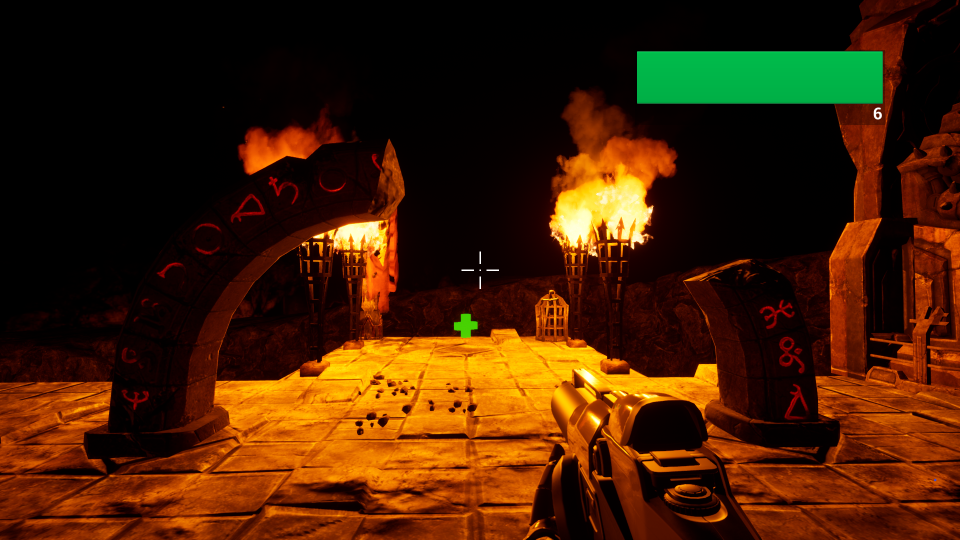

# Doomed


[See full size](doc/doomed.png)

Proof of concept with basic interactions and effects scripted in C++ and blueprint system.
Simple demo of technology for assignment on University of Lower Silesia.

## Demo video
[](https://www.youtube.com/watch?v=G-JqpQsF-PM)

## Instruction
* Head to [Releases](https://github.com/Ursanon/Doomed/releases) and download latest.
* Or build from source.

## How to play?
```
LMB - shoot
F - interaction
WSAD - movement
DEL - subtract life
ESC/Backspace - pause
```

### Elements in game:
* explosive chrome barrels
* pickup system with ammo and healt
* shooting
* interactions:
    * NPC facing player
    * box jumping
    * door opening/closing
* Jumping into lava will end game
* multiple user interfaces and main menu
